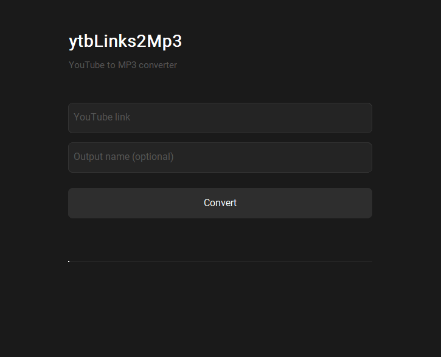

# ytbLinks2Mp3

A simple desktop app that converts YouTube links to an MP3 file with its cover art embedded, ready to use with Spotify Local Files.

## Preview

<div align="center">
  
</div>

## Features

- Paste a YouTube URL and convert it to MP3 in one click
- Automatically embeds the YouTube thumbnail as cover art
- Choose a custom name for your output file
- Files are saved in the `output/` folder

## Prerequisites

Before running the project, make sure you have the following installed on your machine:

- [Python 3.x](https://www.python.org/downloads/) — make sure to check **"Add Python to PATH"** during installation
- [ffmpeg](https://ffmpeg.org/download.html) — download the win64 build, extract it and add the `bin` folder to your system PATH

## Installation

**1. Clone the repository**
```
git clone https://github.com/KozakieOn/ytbLinks2Mp3.git
cd ytbLinks2Mp3
```

**2. Create a virtual environment**
```
python -m venv venv
```

**3. Activate the virtual environment**
```
.\venv\Scripts\activate
```

> If you get a security error on PowerShell, run this first:
> ```
> Set-ExecutionPolicy -ExecutionPolicy RemoteSigned -Scope CurrentUser
> ```

**4. Install dependencies**
```
python -m pip install -r requirements.txt
```

## Usage

**1. Make sure your virtual environment is activated** `(venv)`

**2. Run the app**
```
python main.py
```

**3. In the app**
- Paste a YouTube URL in the input field
- Enter a custom name for your file
- Click **Convert**
- Your MP3 will appear in the `output/` folder with the cover art embedded

## Spotify Local Files

To listen to your converted files on Spotify:

1. Open Spotify → Settings → Local Files
2. Add the `output/` folder as a local files source
3. Your tracks will appear in the Local Files section with their cover art

## Project Structure

```
ytbLinks2Mp3/
│
├── output/
├── venv/
│
├── main.py
├── downloader.py
├── requirements.txt
│
├── .gitignore
└── README.md 
```